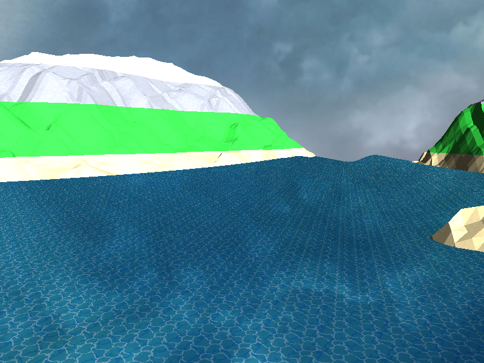

### 运行环境

- OS: win10
- 依赖工具: `mingw`, `cmake`(version >= 3.23.1)


### 运行

在项目根目录打开`shell`

```sh
mkdir build 
cd build
cmake ..
cmake --build .
./water_simulation.exe
```


### 效果



- 使用上下左右方向键控制摄像机移动
- 使用鼠标改变摄像机朝向
- `Q`: 加大潮汐汹涌程度 `M`: 减小潮汐汹涌程度
- `A`: 增加波浪数目 `S`: 减小波浪数目
- `Z`: 增加波浪高度 `X`: 减小波浪高度
- `M`: 启用网格视图


### 海浪模型

- 海浪模型公式

  $y = sin(time * speed +x * z * amount + 0.5 * cos(x * z) *amount )$ * height


**speed**

*speed*控制着海浪的速度, 具体表现为*speed*越大, 海浪高度变化地就越快

在模型公式中, 当*x*, *z*固定, 以*time*为自变量, 那么*speed*增大会导致周期函数周期减小


**amount**

*amount*控制着海浪的数量, 具体可以看下面的数学图像

- *amount = 0.01*


- *amount = 1.0*

  


可以看出, 随着*amount*的增加, 海浪的个数明显增加


**height**

*height*控制着海浪的高度


