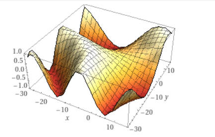
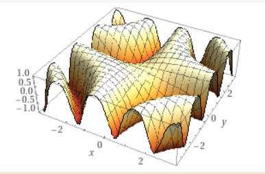

### 海浪模型

- 海浪模型公式

  $y = sin(time * speed +x * z * amount + 0.5 * cos(x * z) *amount )$ * height

**speed**

*speed*控制着海浪的速度, 具体表现为*speed*越大, 海浪高度变化地就越快

在模型公式中, 当*x*, *z*固定, 以*time*为自变量, 那么*speed*增大会导致周期函数周期减小

**amount**

*amount*控制着海浪的数量, 具体可以看下面的数学图像

- *amount = 0.01*

- *amount = 1.0*

  

可以看出, 随着*amount*的增加, 海浪的个数明显增加

**height**

*height*控制着海浪的高度

